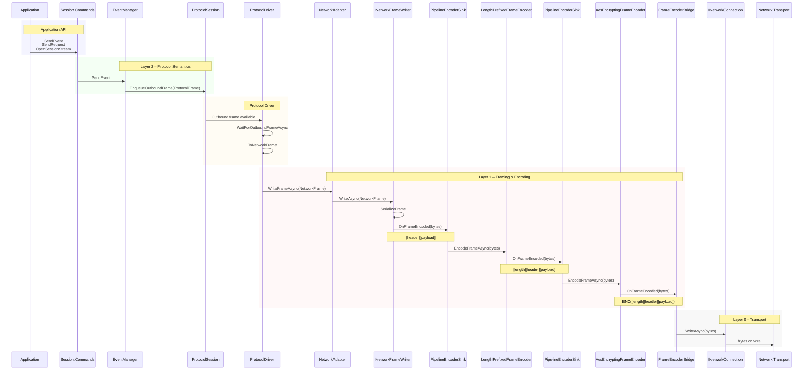
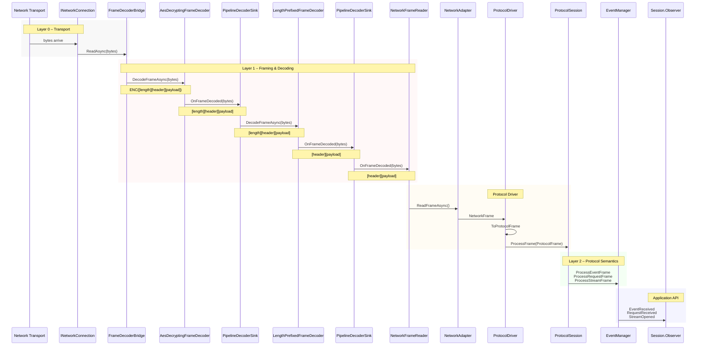

# The Processing Pipeline - Outbound

This document explains the idea behind the network pipeline: a sequence of frame transformations that turn protocol messages into raw bytes for transport, and then reverse the process on receipt.

The key idea is simple:

> A frame flows through a chain of transformations. Each step adds one capability (compression, encryption, framing) without knowing anything about the other steps.

---

## Outbound Pipeline (Sending Data)

---

#### Application API

* The application invokes a protocol command method (`SendEvent`, `SendRequest`, `OpenSessionStream`, etc.) on the session’s `IProtocolSessionCommands` interface.

* The session’s command interface forwards the call to the appropriate domain helper (`EventManager`, `RequestManager`, or `StreamManager`) based on the intent being expressed.

---

#### Layer 2 - Protocol

* The domain helper validates the operation against protocol rules (e.g. stream state, request lifecycle, duplicate IDs) and constructs a `ProtocolFrame` representing the semantic intent.

* The domain helper enqueues the ProtocolFrame onto the session’s internal outbound frame queue via `ProtocolSession.EnqueueOutboundFrame`.

* The ProtocolDriver "write loop" wakes via WaitForOutboundFrameAsync and dequeues the next `ProtocolFrame` from the session.

---

#### Layer 2 - Protocol Driver

* The Protocol Driver converts the `ProtocolFrame` into a transport-agnostic `NetworkFrame` (`ToNetworkFrame`), stripping protocol-only semantics and retaining only framing-relevant metadata and payload bytes.

---

* The ProtocolDriver forwards the `NetworkFrame` to the `NetworkAdapter` via `WriteFrameAsync`.

* The NetworkAdapter hands the `NetworkFrame` to the `NetworkFrameWriter`, marking the boundary between protocol semantics and framing/encoding.

* The NetworkFrameWriter serializes the `NetworkFrame` into raw frame bytes (`ByteSegments`) using the frame serializer (producing `[header][payload]`).

* The serialized frame bytes are emitted into the outbound encoder pipeline via the first `PipelineEncoderSink`.

* Each `PipelineEncoderSink` invokes its associated `IFrameEncoder.EncodeFrameAsync`, passing the bytes and the next sink in the chain.

* The `LengthPrefixedFrameEncoder` prepends a length prefix to the serialized frame bytes and emits the resulting `ByteSegments` to the next sink.

* The `AesEncryptingFrameEncoder` encrypts the framed bytes (including the length prefix) and emits encrypted `ByteSegments` to the terminal sink.

* The terminal sink (`FrameEncoderBridge`) forwards the encoded byte segments to the underlying `INetworkConnection` via `WriteAsync`.

* The `INetworkConnection` writes the byte segments to the concrete transport (e.g. TCP stream), resulting in raw bytes being transmitted to the peer.






---

## What Each Step Does

### ProtocolFrame

A ProtocolFrame represents application-level intent:
- events
- requests
- responses

It has meaning, but no knowledge of how it will be sent on the wire.

---

### ConvertToNetworkFrame

This step maps protocol concepts into a stable wire-level shape. It isolates protocol logic from transport and encoding details.

---

### NetworkFrameWriter

NetworkFrameWriter is the *entry point* to the network pipeline.

Its responsibilities:
- serialize a NetworkFrame into bytes
- produce one logical unit (ByteSegments)
- hand that unit to the encoder chain

Once data enters this stage, protocol semantics are gone.

---

### Encoder Chain

Encoders are applied in order. Each encoder:
- consumes exactly one frame
- produces exactly one frame
- preserves frame boundaries

Each encoder adds a specific capability:

**Compression (gzip)**
- reduces payload size
- improves bandwidth efficiency

**Encryption (AES)**
- protects confidentiality
- ensures integrity

**Framing (length prefix)**
- allows streaming transports to recover frame boundaries

Encoders do not know about protocol fields or transport details.

---

### TransportEncoderSink

This is the bridge between encoding and transport.

It receives fully-encoded frames and writes the bytes to the network connection.

---

### INetworkConnection

INetworkConnection is the *terminal* of the pipeline.

It:
- writes raw bytes
- reads raw bytes
- knows nothing about frames or protocols

At this boundary, all meaning ends.

---

## Inbound Pipeline (Receiving Data)

The receive path is the exact reverse of the send path.

```
Socket / Pipe / Memory
   |
   v
INetworkConnection
   |
   | ProtocolDriver read loop
   v
Raw byte stream
   |
   | Decoder chain
   |   - remove length prefix
   |   - decrypt
   |   - decompress
   v
ByteSegments (one frame)
   |
   | NetworkFrameReader
   v
NetworkFrame
   |
   | ConvertToProtocolFrame
   v
ProtocolFrame
```

Decoders restore frame boundaries and undo each encoding step until a complete frame is recovered.

---

## Key Properties of the Pipeline

- Each step does *one job*
- No step knows about the whole pipeline
- Frame boundaries are preserved end-to-end
- Transports only move bytes
- Protocol code never touches raw bytes

---

## One-Sentence Summary

> The network pipeline is a sequence of frame transformations where each step adds a capability, and the transport simply moves the resulting bytes without understanding their meaning.
