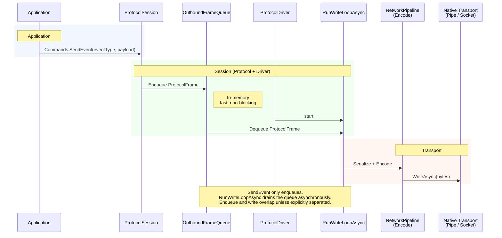
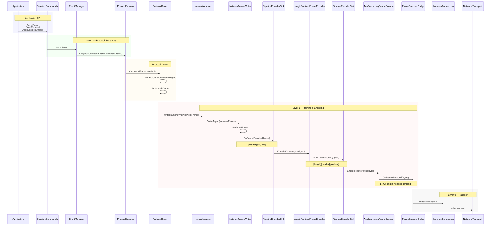

# The Processing Pipeline - Outbound

This document explains the idea behind the outbound network pipeline, which is  a sequence of frame transformations that turn protocol messages into raw bytes for transport, and then reverse the process on receipt.

The key idea is simple:

> A frame flows through a chain of transformations. Each step adds one capability (compression, encryption, framing) without knowing anything about the other steps.

---

## Overview



---

## Details

THe diagram below shows each step in a hypotheical session configured to perform 2 encoding steps in the processing pipeline:

* Length-prefixed encoding
* AES encryption

This session can be constructed using the following SessionBuilder utility methods which configures all of the plumbing in between the two specified codecs (i.e. encoder / decoder pairs):

```csharp
var serverSession =
    new ProtocolSessionBuilder()
        .WithLogger(logger)
        .UseOddStreamIds()
        .ConfigurePipeline(pipeline =>
        {
            pipeline
                .AppendFrameCodec(
                    new LengthPrefixedFrameEncoder(logger),
                    new LengthPrefixedFrameDecoder(logger))
                .AppendFrameCodec(
                    new ASEEncrytionEncoder(logger, aesOptions),
                    new ASEEncrytionDecoder(logger, aesOptions))
                .UseConnection(() => serverConnection);
        })
        .Build();
```

The application then sends an Event (a one-way fire-and-forget message) by invoking `SendEvent(eventType, payload)` on the session’s command interface.

This triggers a sequence of transformations that ultimately results in bytes being sent to the peer (although this has a large number of steps, in tests the library has been able to enqueue over 1,000,000 messages per second onto the network connection for tramsission):



---

#### Application API

* The application invokes a protocol command method (`SendEvent`, `SendRequest`, `OpenSessionStream`, etc.) on the session’s `IProtocolSessionCommands` interface.

* The session’s command interface forwards the call to the appropriate domain helper (`EventManager`, `RequestManager`, or `StreamManager`) based on the intent being expressed.

---

#### Layer 2 - Protocol

* The domain helper validates the operation against protocol rules (e.g. stream state, request lifecycle, duplicate IDs) and constructs a `ProtocolFrame` representing the semantic intent.

* The domain helper enqueues the ProtocolFrame onto the session’s internal outbound frame queue via `ProtocolSession.EnqueueOutboundFrame`.

* The ProtocolDriver "write loop" wakes via WaitForOutboundFrameAsync and dequeues the next `ProtocolFrame` from the session.

---

#### Layer 2 - Protocol Driver

* The Protocol Driver converts the `ProtocolFrame` into a transport-agnostic `NetworkFrame` (`ToNetworkFrame`), stripping protocol-only semantics and retaining only framing-relevant metadata and payload bytes.

---

#### Layer 1 - Framing

* The ProtocolDriver forwards the `NetworkFrame` to the `NetworkAdapter` via `WriteFrameAsync`.

* The NetworkAdapter hands the `NetworkFrame` to the `NetworkFrameWriter`, marking the boundary between protocol semantics and framing/encoding.

* The NetworkFrameWriter serializes the `NetworkFrame` into raw frame bytes (`ByteSegments`) using the frame serializer (producing `[header][payload]`).

* The serialized frame bytes are emitted into the outbound encoder pipeline via the first `PipelineEncoderSink`.

* Each `PipelineEncoderSink` invokes its associated `IFrameEncoder.EncodeFrameAsync`, passing the bytes and the next sink in the chain.

* The `LengthPrefixedFrameEncoder` prepends a length prefix to the serialized frame bytes and emits the resulting `ByteSegments` to the next sink.

* The `AesEncryptingFrameEncoder` encrypts the framed bytes (including the length prefix) and emits encrypted `ByteSegments` to the terminal sink.

---

#### Layer 0 - Transport

* The terminal sink (`FrameEncoderBridge`) forwards the encoded byte segments to the underlying `INetworkConnection` via `WriteAsync`.

* The `INetworkConnection` writes the byte segments to the concrete transport (e.g. TCP stream), resulting in raw bytes being transmitted to the peer.
