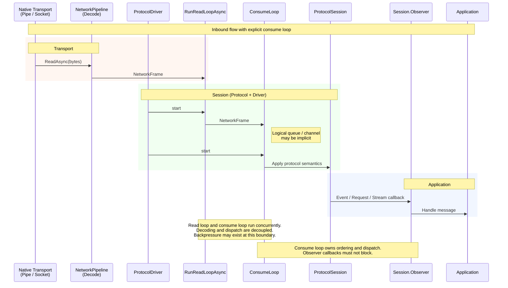
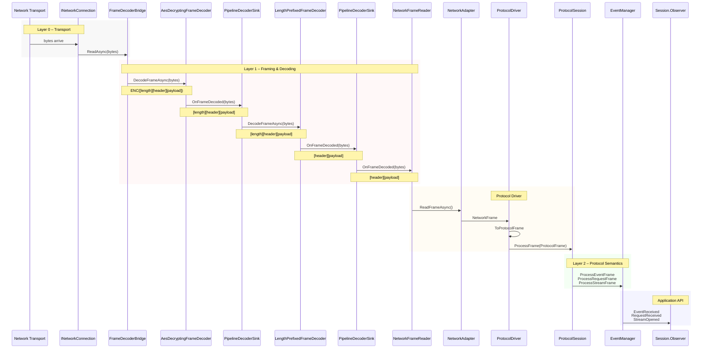

# The Processing Pipeline - Inbound

This document explains the idea behind the network pipeline: a sequence of frame transformations that turn protocol messages into raw bytes for transport, and then reverse the process on receipt.

The key idea is simple:

> A frame flows through a chain of transformations. Each step adds one capability (compression, encryption, framing) without knowing anything about the other steps.

---

## Overview

---

## Details

